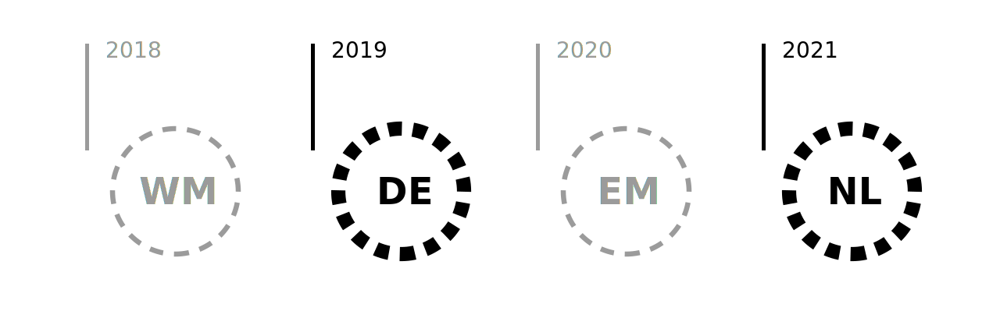
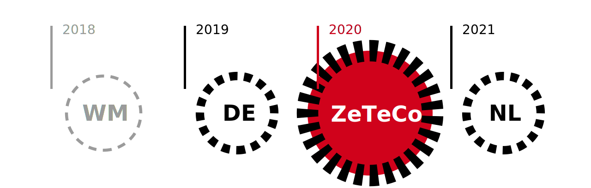

import { Head, Image } from 'mdx-deck'
import Start from './src/Components/start'
import Video from './src/Components/video'
export theme from './src/theme'
import Invert from './src/layouts/Invert'

<Head>
  <title>ZeTeCo</title>
  <link href="https://fonts.googleapis.com/css?family=Work+Sans:400,700,900" rel="stylesheet" />
</Head>

# start
---
export default Start

### &nbsp;

<Video
  loop={true}
  src="./intro/intro.mp4"
/>

---

# Technik- und Computercamps
### Gemeinschaftsprojekte

 
 
 
 
 
 

#### [DIY Gathering – Flick the World](http://wiki.sgmk-ssam.ch/wiki/DIY_Gathering_-_Flick_the_World) | Talk 30. September 2018 | Stefan Huber
---
## Woher und wohin?

---
## Chaos Computer Club
### Deutschland
>> 1981

---
## Chaos Communication Congress
### Deutschland
>> 1984
---

## Galactic Hacker Party
### Holland
>> 1989

---
## Camps – Holland

* GHP – 1989 <!-- Galactic Hacker Party -->
* HEU – 1993 <!-- Hacking till the End of the Universe -->
* HIP – 1997 <!-- Hacking In Progress -->
* HAL – 2001 <!-- Hackers At Large -->
* WTH – 2005 <!-- What the Hack -->
* HAR – 2009 <!-- Hacking At Random -->
* OHM – 2013 <!-- Observe. Hack. Make. -->
* SHA – 2017 <!-- Still Hacking Anyway -->

---
## Chaos Computer Club (CCC)
### Deutschland
>> 1999
---
## Sommerplanung
---
export default Invert

---

## Idee
### Sommer/Herbst 2016
---

## ZeTeCo
### 21. bis 24. Juli 2017
---
## Was wir brauchen?
---
# Alles!
---
## Konkret
* Community
* Infrastruktur
---
# Community
---
<Image src='./img/tony/IMAG0567.jpg'/>
---
## Grober Plan
### Griesbach, Schaffhausen
---

<Video
  src="./film/campground.mp4"
/>

---

## Community & Geld
---
## [→ wemakeit](https://wemakeit.com/projects/maker-hacker-camp-zeteco-2017/)
---
## Kommunikation
* Twitter
* [Wiki](https://wiki.zeteco.ch/wiki/Static:Hauptseite)
* Slack (Chat)
* [Grafik](https://zeteco.ch/)
---
## Vorbereitung
* Rechtliches/Auflagen
* Internet
* Orga...Orga...Orga...
---
# Aufbau
---
## Hackcenter!
---
<Image src='./img/tony/IMAG2881.jpg'/>

---
## Lounge
---
<Image src='./img/tony/IMAG2892.jpg'/>
---
## Pool
---
<Image src='./img/tony/IMAG2921.jpg'/>
---
## Datenklos?
[→ Vorbild](https://twitter.com/stefanmmueller/status/826126859578515456)
---
<Image src='./img/tony/IMAG2987.jpg'/>
---
# sudo run ./zeteco
---
## [Talks](https://www.youtube.com/watch?v=QQt_zwwDHmY)
---
## Bar & Essen
---
<Image src='./img/tony/IMAG2989.jpg'/>
---
## Maker & Hacker
---
<Image src='./img/tony/IMAG2992.jpg'/>
---
<Image src='./img/tony/IMAG2975.jpg'/>
---

## Workshop
---
<Image src='./img/tony/IMAG2980.jpg'/>
---
# Badge
---
<Image src='./img/tony/IMAG2687.jpg'/>
---
<Video
  src="./film/badge.mp4"
/>
---

# Learnings

---
## Community
* es ist wunderbar...
* und schwierig...
---
# Diversität!

---
## Freiheit
### Wer macht, machts richtig!
---
## Planung
### Wer sagt er machts, sollte es machen!
---
## Offenheit
### Wer nicht sagt er machts und es dann doch macht, machts auch richtig.

---
## Infrastruktur
* Es braucht Leute...
* Ideen hat jeder, Zeit nicht
---
## Auflagen
---
<Image src='./img/tony/IMAG2774.jpg'/>
---
<Image src='./img/tony/IMAG2776.jpg'/>
---
## Abschluss
* Finanzen
* Wissenswahrung
* Wie weiter? Ermüdung...

---
## ZeTeCo schön war's!
---
## See you soon!
---
export default Invert

---
## Danke
* Euch für die Aufmerksamkeit
* Tony-Stamm für Fotos & Videos
* Allen für die tolle Zeit!

## [→ Slides: https://goo.gl/gc523f](https://github.com/signalwerk/talk.dock18.2018)
* [CC-BY-SA-4.0](https://creativecommons.org/licenses/by-sa/4.0/)
---
## One more thing!
---

export default Invert

## ZeTeCo 2020

---

## exit 0;
